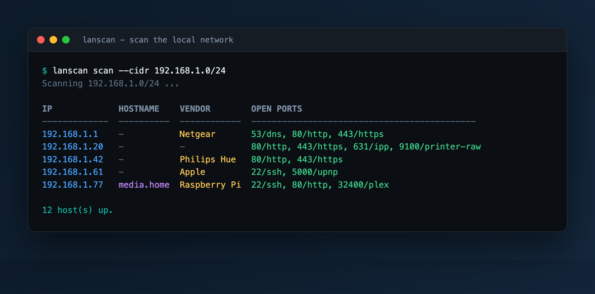
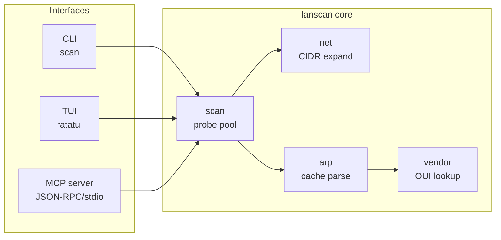

# LAN Scan

[](LICENSE)
[](https://www.rust-lang.org)

**A pure-Rust home LAN scanner with three faces on one engine: a CLI, a live TUI, and an MCP server.**

Point it at your home network and it discovers what is actually online: live hosts, their open ports and likely services, hardware (MAC) addresses, and vendor guesses (Raspberry Pi, Apple, Philips Hue, printers, and more). No root, no raw sockets, no external services.



<sub>(example output; addresses and vendors are illustrative)</sub>

## Why

Most home-network scanners are either heavyweight installs or need root for raw
ICMP. LAN Scan stays deliberately small: it finds hosts by making ordinary TCP
connections to a handful of common ports and enriches them from the system ARP
cache. That means it runs unprivileged on macOS and Linux, builds to a single
~700 KB binary, and is easy to audit.

The MCP server is the differentiator: point any MCP-capable agent at it and the
model can scan your network as a tool call.

## Features

- **Three interfaces, one core** - `scan` (CLI), `tui` (interactive), `mcp` (agent-callable), all sharing the same scanning library.
- **No root required** - TCP-connect discovery plus ARP-cache enrichment; no raw sockets.
- **Fast and bounded** - a fixed pool of worker threads probes every host/port pair concurrently, so wall-clock time tracks the slowest single probe, not the sum.
- **Useful identity** - MAC address, vendor from a curated OUI table (~8.5k consumer prefixes), reverse-DNS hostname, and service names for open ports.
- **JSON or table** - human table by default, `--json` for scripting.
- **Tiny footprint** - five runtime dependencies, `#![forbid(unsafe_code)]`, LTO release build.

## Install

```bash
git clone https://github.com/bunlongheng/lanscan
cd lanscan
cargo build --release
# binary at ./target/release/lanscan
```

## Usage

### CLI

```bash
# Scan the auto-detected local /24
lanscan scan

# Scan a specific network, custom ports, as JSON
lanscan scan --cidr 192.168.1.0/24 --ports 22,80,443 --json

# Tune the probe
lanscan scan --cidr 192.168.1.0/24 --timeout-ms 300 --concurrency 512

# Filter results across any field (IP, MAC, hostname, vendor, port/service)
lanscan scan --filter amazon      # only Amazon devices
lanscan scan -f http              # only hosts with an HTTP port
lanscan scan -f 88:57             # only a MAC prefix
```

| Flag | Default | Meaning |
|------|---------|---------|
| `--cidr` | local /24 | Network to scan, e.g. `192.168.1.0/24` |
| `--ports` | common set | Comma-separated TCP ports to probe |
| `--filter`, `-f` | off | Show only hosts matching this text (case-insensitive) in any field |
| `--timeout-ms` | 400 | Per-connection timeout |
| `--concurrency` | 256 | Max concurrent probes |
| `--json` | off | Emit JSON instead of a table |

### TUI

```bash
lanscan tui
```

`r` rescans, `/` filters (type to narrow across every field, `Enter` applies,
`Esc` clears), arrow keys (or `j`/`k`) move the selection, `q` quits.

### MCP server

`lanscan mcp` speaks the Model Context Protocol over stdio. Register it with any
MCP client. For Claude Code:

```json
{
  "mcpServers": {
    "lanscan": {
      "command": "/absolute/path/to/lanscan",
      "args": ["mcp"]
    }
  }
}
```

Exposed tools:

| Tool | Arguments | Returns |
|------|-----------|---------|
| `scan_network` | `cidr?`, `ports?`, `timeout_ms?` | Live hosts with open ports, MAC, hostname, vendor |
| `arp_table` | none | The local ARP cache with vendor enrichment |

Quick manual check:

```bash
printf '%s\n' \
  '{"jsonrpc":"2.0","id":1,"method":"initialize"}' \
  '{"jsonrpc":"2.0","id":2,"method":"tools/list"}' | lanscan mcp
```

## How it works



1. **Expand** the target CIDR into host addresses.
2. **Probe** every host/port pair over a bounded thread pool using
   `TcpStream::connect_timeout`. A completed connection means the port is open.
3. **Enrich** from the ARP cache (`arp -a`): MAC address and a vendor guess by
   OUI prefix. Live hosts the ARP cache did not name are reverse-resolved via
   the system resolver (concurrently, so DNS never serializes the scan).
4. A host is **live** if it answered any probe or has a resolved ARP entry in
   range. Incomplete ARP entries are ignored so the results stay honest.

## Design decisions

| Decision | Why |
|----------|-----|
| TCP connect, not raw ICMP | Runs unprivileged on macOS and Linux |
| `std` threads, no async runtime | Smaller dep tree and binary; the work is I/O-bound and bounded |
| Hand-rolled MCP over stdio | No SDK version churn; the protocol surface is tiny and fully unit-tested |
| Curated OUI table (consumer brands), not the full registry | Covers home devices while staying small; prefixes are packed `u32` + a name index and binary-searched. Unknown prefixes resolve to `None`, never a wrong guess |
| Ignore incomplete ARP entries | macOS caches unresolved neighbors for the whole subnet; counting them would report phantom hosts |

## Development

```bash
./scripts/ci.sh        # runs fmt check + clippy + tests (the CI gate)

# or individually:
cargo test --all       # unit + end-to-end tests
cargo clippy --all-targets -- -D warnings
cargo fmt --all --check
```

CI is defined in `.circleci/config.yml` but is currently **run manually** via
`./scripts/ci.sh`. The CircleCI project is intentionally left unconnected until
the monthly billing quota resets; connecting it on
[app.circleci.com](https://app.circleci.com) is all that is needed to activate it.

## Project layout

```
src/
  main.rs       # CLI entry point: scan / tui / mcp subcommands, arg parsing
  lib.rs        # library root re-exporting the modules below
  net.rs        # local-IP discovery and CIDR expansion
  scan.rs       # core engine: probe pool, ARP + mDNS enrichment, host assembly
  arp.rs        # system ARP-cache reader and BSD/Linux `arp -a` parser
  vendor.rs     # packed OUI -> vendor table (~8.5k prefixes), binary search
  services.rs   # well-known port -> service names and the default scan set
  output.rs     # table and JSON renderers for scan results
  tui.rs        # ratatui live UI: table, per-field filter, device icons
  mcp.rs        # hand-rolled Model Context Protocol server over stdio
tests/
  cli.rs        # end-to-end tests driving the built binary
scripts/
  ci.sh         # the manual CI gate: fmt check + clippy + tests
```

## License

[MIT](LICENSE) © Bunlong Heng

---

<p align="center">
  <sub>Built by <a href="https://bunlongheng.com">Bunlong Heng</a> &middot; <a href="https://bunlongheng.com/projects/lanscan">See it in my portfolio &rarr;</a></sub>
</p>
